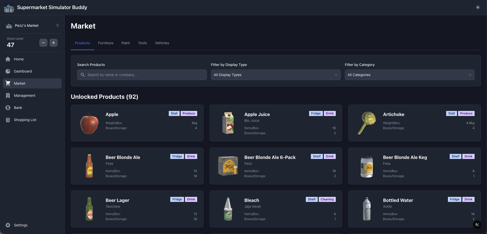

# Supermarket Simulator Buddy

A comprehensive progress tracking companion app for [Supermarket Simulator](https://supermarketsimulator.com/). Manage multiple playthroughs, track your store growth, manage licenses, monitor finances, and organize your shopping lists—all in one place.



## Features

### 🎮 Multiple Playthroughs

- Create and manage unlimited playthroughs
- Track different strategies and challenge runs separately
- Switch between playthroughs easily with the sidebar dropdown

### 📊 Comprehensive Tracking

- **Store Level Management**: Track your store's progression
- **License Management**: Monitor all product licenses and see what items each unlocks
- **Storage & Growth Sections**: Track store expansion and storage upgrades
- **Furniture & Paint**: Keep track of purchased store customizations
- **Tools & Vehicles**: Manage your equipment and delivery vehicles

### 💰 Financial Tracking

- Budget tracking across all categories
- Total spending summaries for licenses, storage, growth, furniture, paint, tools, and vehicles
- Bank loan management and tracking

### 📝 Shopping Lists

- Create custom shopping lists organized by shop location
- Automatic grouping by:
  - Deli and Grocery
  - Meat and Dairy
  - Green Market
  - Liquor Store
  - Janitorial Supply
  - No Shop Available (for items not available at shops)
- Checkbox tracking for purchased items
- Quantity management with box counts

### 💾 Data Management

- Export your progress as JSON for backup
- Import data anytime
- All data stored locally in browser localStorage
- No server required, complete privacy

### 🎨 Modern UI

- Clean, responsive design
- Dark mode support
- Mobile-friendly interface
- Built with Flowbite React components

## Technology Stack

- **Framework**: [Next.js 16](https://nextjs.org/) with App Router
- **React**: v19 with React Server Components (RSC)
- **TypeScript**: Strict mode enabled
- **Styling**: [Tailwind CSS v4](https://tailwindcss.com/) with PostCSS
- **UI Library**: [Flowbite React v0.12.10](https://flowbite-react.com/)
- **Icons**: [React Icons](https://react-icons.github.io/react-icons/)
- **Notifications**: [React Toastify](https://fkhadra.github.io/react-toastify/)
- **State Management**: React Context API
- **Data Persistence**: Browser localStorage

## Getting Started

### Prerequisites

- Node.js 18.x or higher
- npm, yarn, or pnpm

### Installation

1. Clone the repository:

```bash
git clone https://github.com/chiefpansancolt/supermarket-simulator-buddy.git
cd supermarket-simulator-buddy
```

2. Install dependencies:

```bash
npm install
# or
yarn install
# or
pnpm install
```

3. Run the development server:

```bash
npm run dev
# or
yarn dev
# or
pnpm dev
```

4. Open [http://localhost:3000](http://localhost:3000) in your browser

## Development Commands

### Running the Application

```bash
npm run dev          # Start development server
npm run build        # Build for production
npm run start        # Start production server
```

### Code Quality

```bash
npm run lint         # Run ESLint
npm run format       # Format code with Prettier
npm run format:check # Check formatting without modifying files
```

## Project Structure

```text
supermarket-simulator-buddy/
├── public/
│   ├── assets/
│   │   └── images/        # Background and assets
│   ├── logo.jpg           # App logo
│   └── screenshot.png     # App screenshot
├── src/
│   ├── app/              # Next.js App Router pages
│   │   ├── (home)/       # Landing page
│   │   ├── dashboard/    # Playthrough dashboard
│   │   ├── management/   # Licenses, storage, growth
│   │   ├── market/       # Furniture, paint, tools, vehicles
│   │   ├── shopping-list/ # Shopping list management
│   │   ├── bank/         # Loan tracking
│   │   ├── settings/     # Data import/export
│   │   ├── layout.tsx    # Root layout
│   │   └── globals.css   # Global styles
│   ├── components/       # React components
│   │   ├── AppNavbar.tsx
│   │   ├── AppSidebar.tsx
│   │   └── LayoutContent.tsx
│   ├── data/             # Game data and constants
│   │   ├── constants/
│   │   └── supermarket-simulator/
│   ├── lib/              # Utilities and services
│   │   ├── contexts/     # React Context providers
│   │   └── services/     # localStorage service
│   └── types/            # TypeScript type definitions
├── .flowbite-react/      # Flowbite config (auto-managed)
├── CLAUDE.md            # AI development guide
├── README.md
├── next.config.ts
├── tailwind.config.ts
├── tsconfig.json
└── package.json
```

## Usage Guide

### Creating a Playthrough

1. Click the dropdown in the sidebar
2. Select "Create New Playthrough"
3. Enter a name and optional description
4. Your new playthrough is now active

### Managing Store Progress

1. Navigate to **Management** to track:
   - Licenses (unlock product categories)
   - Storage sections
   - Growth areas

2. Navigate to **Market** to track purchases:
   - Furniture
   - Paint
   - Tools
   - Vehicles

### Creating Shopping Lists

1. Go to **Shopping List**
2. Click "Add Products"
3. Search and select products from your unlocked licenses
4. Items are automatically grouped by shop location
5. Check off items as you purchase them

### Exporting/Importing Data

1. Go to **Settings**
2. Click "Export Data" to download a JSON backup
3. Use "Import Data" to restore from a backup file

## Data Storage

All data is stored locally in your browser using localStorage under the key `supermarket-simulator-buddy`. Your data includes:

- All playthroughs
- Active playthrough selection
- Store levels and unlocked items
- Shopping lists
- Financial tracking

## Browser Compatibility

- Chrome/Edge (recommended)
- Firefox
- Safari
- Any modern browser with localStorage support

## Contributing

Contributions are welcome! Please feel free to submit a Pull Request.

1. Fork the repository
2. Create your feature branch (`git checkout -b feature/AmazingFeature`)
3. Commit your changes (`git commit -m 'Add some AmazingFeature'`)
4. Push to the branch (`git push origin feature/AmazingFeature`)
5. Open a Pull Request

## Code Style

This project uses:

- **Prettier** for code formatting (tabs for indentation)
- **ESLint** for code linting
- Automatic import sorting

Run `npm run format` before committing.

## Disclaimer

This application is not affiliated with, endorsed by, or connected to Supermarket Simulator or its developers. All trademarks and game content are the property of their respective owners.

This is a fan-made tool created to enhance the gaming experience.

## Links

- [Official Supermarket Simulator Game](https://supermarketsimulator.com/)
- [Report Issues](https://github.com/chiefpansancolt/supermarket-simulator-buddy/issues)
- [GitHub Repository](https://github.com/chiefpansancolt/supermarket-simulator-buddy)

## Acknowledgments

- Built with [Next.js](https://nextjs.org/)
- UI components from [Flowbite React](https://flowbite-react.com/)
- Icons from [React Icons](https://react-icons.github.io/react-icons/)
- Inspired by the amazing [Supermarket Simulator](https://supermarketsimulator.com/) game

---

Made with ❤️ for the Supermarket Simulator community
